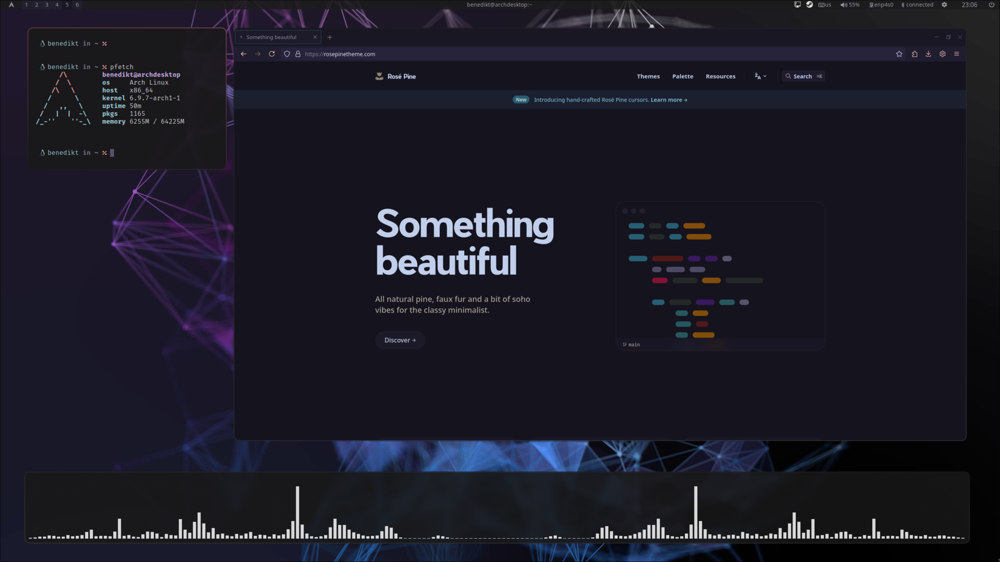
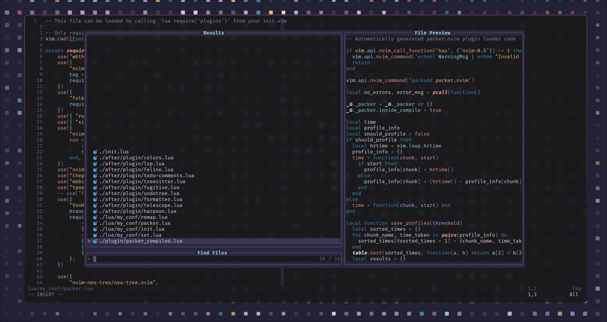
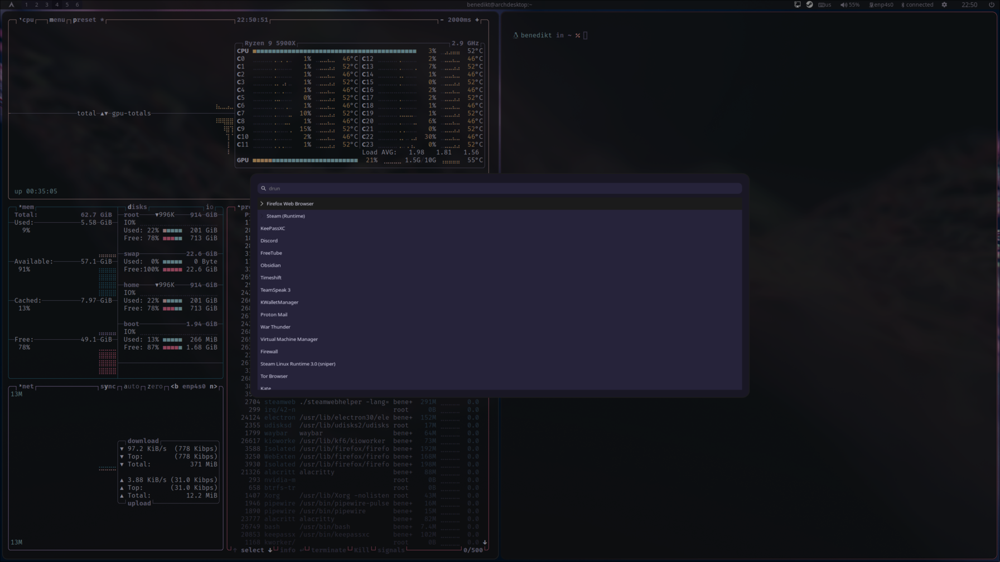

# Welcome
These are my current dotfiles. You may find some of it useful.
I'm currently using [Hyprland](https://github.com/hyprwm/Hyprland).

**Feel free to use and share.**

# Preview

# Also Used
## btop Theme
https://github.com/rose-pine/btop

## Hyprcursor
https://github.com/ndom91/rose-pine-hyprcursor

# TODO
- Notifications that are not annoying
- Notifications for volume and brightness changes
